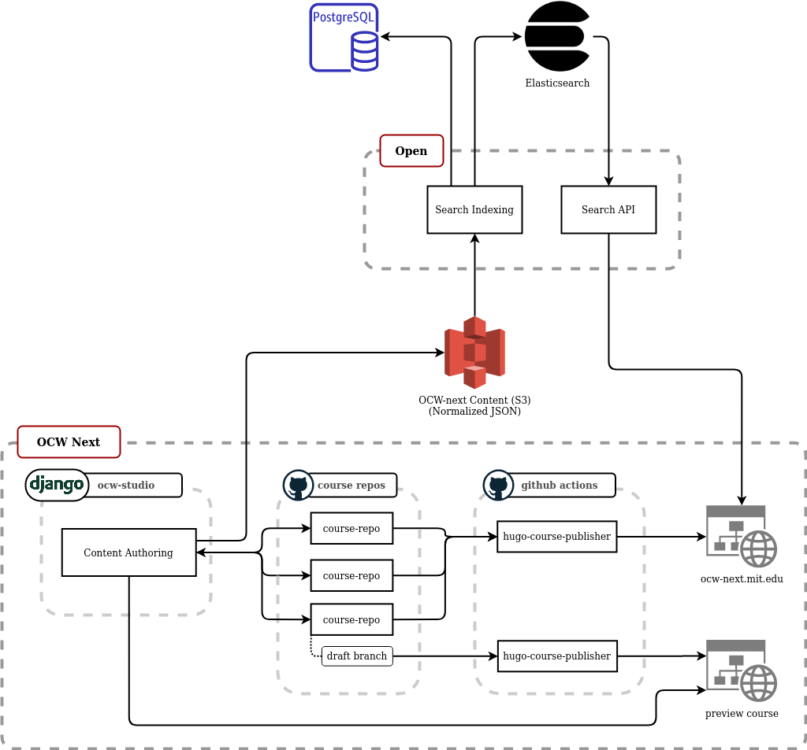
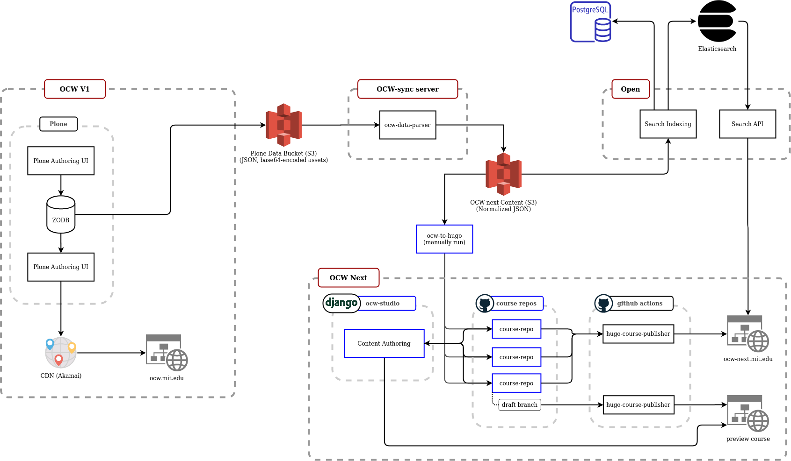

# Data Pipelines
{: .no_toc }

## Table of Contents
{: .no_toc .text-delta }

- Table of Contents
{:toc}

### Summary

This document outlines how data flows function in OCW-next prior to the rework of the architecture. It serves as a baseline to inform our decision making and scoping of those efforts. Currently some of the pipeline is manual, and some of it is not the most time-efficient.

### Desired Architecture Qualities

- **Decentralized**
  - Empower course authors to create and publish content in a non-centralized way
- **Versioned**
  - Support course authors to be able to make changes without losing historical versions
  - Support course authors being able to revert to or work off of older versions of course content
  - Support course authors being able to work on a non-published draft version of a course
- **Previewable**
  - Support course authors being able to preview their course material as it will appear when published
- **Simplicity**
  - We're aiming to build a favorable user experience for course authors that gets out of their way and makes their jobs as easy as possible
  - The system should favor simplifying or limiting complex functionality, but design and implement with future flexibility in mind

### Current Architecture

|  |
|:--:|
| [full version](assets/OCW-next-current.png) |

Major components here are:

- **OCW V1** - running on Plone
- **MIT Open:**
  - Manages normalization of Plone data
  - Stores normalized data in-memory in Postgres
  - Indexes normalized data in-memory to Elasticsearch
- **OCW-next:**
  - In-progress implementation of the next version of OCW, using [Hugo](https://gohugo.io/)
  - Deployment of updated course content is manual

### Final Architecture

|  |
|:--:|
| [full version](assets/OCW-next-final.png) |

- **ocw-sync**
  - Lightweight Python script running `ocw-data-parser`
  - Enables rapid iteration of `ocw-data-parser` not bound to Open releases
  - The life expectancy of this is only until OCW-v1 is decommissioned
- **ocw-to-hugo**
  - This will still be run manually, since we only need to run it infrequently
- **ocw-studio**
  - This is the course content authoring app, implemented in Dango
  - Responsible for the UX and any ancillary data required to support editing
  - Writes to github repos, utilizing two primary branches: `published` and `draft`
- **course repos**
  - Per-course github repos
  - Permissions will be managed via GitHub
- **github actions**
  - Github actions build and deploy the site using `hugo-course-publisher`
  - Also responsible for deploying preview builds of draft content
    - This needs to be fast, so we're looking to only build the pages relevant to the individual course being previewed

### Roadmap

#### Decouple Open from OCW

Open is currently ingesting both the Plone data and indexing that data in-memory as it does so. This is both beyond the area of responsibility Open should be responsible for and inflexible for decommissioning OCW-v1 as the source of truth. Eventually, `ocw-next` will be generating this data, so we need to we need to modify Open so that it sources data from the normalized data stored in an S3 bucket.

- [ ] Extract `ocw-data-parser` execution out of Open and into its own service
- [ ] Modify Open course to source data from normalized S3 bucket and drop its usage of `ocw-data-parser`

|  |
|:--:|
| _Architectural changes highlighted in blue_ [full version](assets/OCW-next-intermediate-1.png) |

#### Develop OCW-studio

- [ ] Create the `ocw-studio` course content authoring application
- [ ] Create repositories for all existing courses
- [ ] Update `hugo-course-publisher` to support courses living in their own repositories
- [ ] Support per-course preview rendering of content (this needs to be fast, so no full-site builds)
- [ ] Automate generation of normalized OCW JSON data from `ocw-studio` into S3 (feature-flagged for production switchover)
- [ ] Trigger Open reindexing when courses are authored or changed in `ocw-studio` (feature-flagged for production switchover)

#### Operations

- [ ] Create an RC environment for testing out `ocw-studio`
- [ ] Automate deployment of `ocw-studio` authored content

|  |
|:--:|
| _Architectural changes highlighted in blue_ [full version](assets/OCW-next-intermediate-2.png) |
