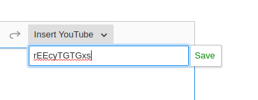

# Adding a custom plugin to CKEditor
---

## Contents

1. [Writing the Editing Plugin](#writing-the-editing-plugin)
    1. [Define a new plugin](#define-a-new-plugin)
    1. [Define the schema](#define-the-schema)
    1. [Define converters](#define-converters)
    1. [Putting the editing plugin together](#putting-the-editing-plugin-together)
1. [Writing the UI plugin](#writing-the-ui-plugin)
    1. [Element creator helper function](#element-creator-helper-function)
    1. [Element creator `Command`](#element-creator-command)
    1. [Putting the UI plugin together](#putting-the-ui-plugin-together)
1. [Adding Markdown support](#adding-markdown-support)
    1. [showdown for md->html](#showdown-for-md-html)
    1. [turndown for html->md](#turndown-for-html-md)
    1. [Writing a MarkdownSyntaxPlugin](#writing-a-markdownsyntaxplugin)
1. [Pulling it all together](#pulling-it-all-together)
    1. [Adding a glue plugin](#Adding-a-glue-plugin)
    1. [Configuring CKEditor](#Configuring-CKEditor)
        1. [Adding the plugin](#Adding-the-plugin)
        1. [Configure the toolbar](#configure-the-toolbar)

---

This document describes how to add a custom plugin to CKEditor, using the example of embedding a YouTube video as a simple example.

A complete example showing the full implementation of this example can be found here: <https://github.com/mitodl/ocw-studio/commit/25f57c11540fd001a985b38fdd50a321fba67a4e>

At a conceptual level, in order to support something like this we need to define a new type of node that will be allowed in our document. CKEditor is a [_schema-based_ editor](https://ckeditor.com/docs/ckeditor5/latest/framework/guides/architecture/editing-engine.html#schema), so this has to be done explicitly and in advance. To fully define our custom YouTube embed we'll need to do the following:

- register the new node type in the schema, defining [where it may be inserted](https://ckeditor.com/docs/ckeditor5/latest/framework/guides/deep-dive/schema.html#defining-allowed-structures) and what [type of content it can hold](https://ckeditor.com/docs/ckeditor5/latest/framework/guides/architecture/editing-engine.html#element-types-and-custom-data)
- define [converters](https://ckeditor.com/docs/ckeditor5/latest/framework/guides/deep-dive/conversion/custom-element-conversion.html) so that CKEditor can perform three different conversions:
    - from input HTML input to an internal, in-memory representation
    - from internal representation back to HTML for output
    - from internal representation to HTML for display in the editor while the user is editing
- implement a [Command](https://ckeditor.com/docs/ckeditor5/latest/framework/guides/architecture/core-editor-architecture.html#commands) for inserting our custom element into the editor.

After we have those things in place we pretty much just need to write some glue code to write all this together as a [CKEditor plugin](https://ckeditor.com/docs/ckeditor5/latest/framework/guides/creating-simple-plugin.html) and that's it. There are a few quirks in how this all works, but overall it's not so so bad.

To show how it works we'll go through an example plugin which adds a YouTube embed to the editor, with an embedded preview that shows the video.

## Writing the Editing Plugin

The first thing we'll start with is the _editing plugin_. This plugin will register our custom object in the editor's [schema](https://ckeditor.com/docs/ckeditor5/latest/framework/guides/architecture/editing-engine.html#schema) and it will also define 1) how to represent the node type in the editing UI and 2) how to serialize and deserialize it. We'll also write a second plugin (below) which is only concerned with providing the ability to _insert_ a YoutubeEmbed node into the document.

So let's get started!

### Define a new plugin

We'll do so by creating a new class that extends
`@ckeditor/ckeditor5-core/src/plugin` and defining a constant for our new
model:

```ts
import Plugin from "@ckeditor/ckeditor5-core/src/plugin"

const YOUTUBE_EMBED = "youtubeEmbed"

class YoutubeEmbedEditing extends Plugin {
  init() {}
}
```

The `init` method will be called when the plugin is instantiated, so we'll call
our methods for defining the schema and the converters from there.

### Define the schema

We need to write a bit of code to let CKEditor know about what we're trying to
have it do. Because we're trying to add an embedded video player we want this
to be a *root-level* node, meaning a node that cannot be inserted into the
middle of a paragraph. We also need to store a bit of text inside of the node,
so we can store the video ID of the video which the user is embedding.

Here's how we can do that:

```ts
class YoutubeEmbedEditing extends Plugin {
  _defineSchema() {
    // we grab the already existing schema from `this.editor`
    const schema = this.editor.model.schema

    // we register a new node type called `youtubeEmbed`, and
    // add some restrictions on where it can appear and what it
    // can contain
    schema.register(YOUTUBE_EMBED, {
      isObject:       true,
      allowWhere:     "$block", // blocks can only appear at root level
      allowContentOf: "$block"  // we want our node to be able to contain text
    })
  }
}
```

There are several different values possible for both `allowWhere` and
`allowContentOf`. You can find more information about these values (and more
possible configuration)
[here](https://ckeditor.com/docs/ckeditor5/latest/framework/guides/deep-dive/schema.html).

### Define converters

Converters is CKEditor's name for serializing to/from HTML. We need to do three conversions:

- `"upcast"`: from input HTML to internal representation, HTML -> Model
- `"dataDowncast"`: from internal representation to output HTML, Model -> HTML
- `"editingDowncast"`: from internal representation to 'in-editor' HTML (so we can show a rich UI to the user), Model -> View

For the sake of a simple example, let's assume that we want to store our YouTube embeds in a format like this:

```html
<section class="youtube-embed">oGCTZWw2aVA</section>
```

In the editor, however, we want the user to see something more like this:

```html
<iframe
  width="560"
  height="315"
  src="https://www.youtube.com/embed/oGCTZWw2aVA"
  frameborder="0"
  allow="accelerometer; autoplay; clipboard-write; encrypted-media; gyroscope; picture-in-picture"
  allowfullscreen>
</iframe>
```

Here's how we can do this! We're going to write a `_defineConverters` method:

```ts
class YoutubeEmbedEditing extends Plugin {
  _defineConverters() {
    // we start by grabbing the conversion property off of `this.editor`
    const conversion = this.editor.conversion
    // ...
  }
}
```

Then we need to define three conversions by calling `conversion.for(TYPE).elementToElement`. First we'll do the `"upcast"`, which basically tells CKEditor how to recognize an HTML tag which we want to convert into a `"youtubeEmbed"`:

```ts
const YOUTUBE_EMBED_CLASS = "youtube-embed"

class YoutubeEmbedEditing extends Plugin {
  _defineConverters() {
    // ...
    conversion.for("upcast").elementToElement({
      model: YOUTUBE_EMBED,
      view:  {
        name:    "section",
        classes: YOUTUBE_EMBED_CLASS
      }
    })
    // ...
  }
}
```

The converter for the `"dataDowncast"`, which converts back to HTML for data output, looks very similar:

```ts
const YOUTUBE_EMBED_CLASS = "youtube-embed"

class YoutubeEmbedEditing extends Plugin {
  _defineConverters() {
    // ...
    conversion.for("dataDowncast").elementToElement({
      model: YOUTUBE_EMBED,
      view:  {
        name:    "section",
        classes: YOUTUBE_EMBED_CLASS
      }
    })
    // ...
  }
}
```

Then our final converter is `"editingDowncast"`, which converts a node into HTML to display to the user in the actual editing UI. This can be thought of as a Model -> View conversion. In this case, since we're embedding a youtube video, we'd like to render a youtube embed `<iframe>`, so the user can preview the video and so on right there in the editor. This one is a little more involved than the other two:

```ts
class YoutubeEmbedEditing extends Plugin {
  _defineConverters() {
    // ...
    conversion.for("editingDowncast").elementToElement({
      model: YOUTUBE_EMBED,
      view:  (modelElement: any, { writer: viewWriter }: any) => {
        // this gives us the text content in the modelElement
        const videoId = modelElement._children._nodes[0]._data
        const iframe = viewWriter.createContainerElement("iframe", {
          class: YOUTUBE_EMBED_CLASS,
          src:   youtubeEmbedUrl(videoId),
          ...YOUTUBE_EMBED_PARAMS
        })
        return toWidget(iframe, viewWriter, { label: "Youtube Embed" })
      }
    })
    // ...
  }
]
```

where `youtubeEmbedUrl` is a function to format an embed URL like <https://www.youtube.com/embed/oGCTZWw2aVA> and `YOUTUBE_EMBED_PARAMS` is an object containing the attributes we want to put on our embed iframe.

**NOTE**: Check out the use of `toWidget` in the `"editingDowncast"` `view` function above. This is a nice utility that makes our custom nodes behave a lot more like the built-in ones (they can be deleted with the backspace key, for instances, among a few other things). More info [here](https://ckeditor.com/docs/ckeditor5/latest/api/module_widget_widget-Widget.html).

Anyhow, that's all we need to do for the conversion. A lot more documentation on this topic can be found [here](https://ckeditor.com/docs/ckeditor5/latest/framework/guides/deep-dive/conversion/custom-element-conversion.html). Overall, it is not terribly difficult to add a custom type in this way, and as long as we keep our HTML representations different and unambiguous we shouldn't run into any problems.

### Putting the editing plugin together

After we've written `_defineSchema` and `_defineConverters` we're pretty much done, all we need to do is make sure that those methods are both called in the `init` method.

Here's the full source for this plugin:

```ts
class YoutubeEmbedEditing extends Plugin {
  init() {
    this._defineSchema()
    this._defineConverters()
  }

  _defineSchema() {
    const schema = this.editor.model.schema

    schema.register(YOUTUBE_EMBED, {
      isObject:       true,
      allowWhere:     "$block",
      allowContentOf: "$block"
    })
  }

  _defineConverters() {
    const conversion = this.editor.conversion

    /**
     * `upcast` converts the HTML string to a view element (i.e. ckeditor
     * internal state, *not* to a DOM element)
     *
     * providing 'iframe' and YOUTUBE_EMBED_CLASS allows CKEditor to recognize
     * the iframe in our converted HTML and convert it to a `youtubeEmbed` object
     */
    conversion.for("upcast").elementToElement({
      model: YOUTUBE_EMBED,
      view:  {
        name:    "section",
        classes: YOUTUBE_EMBED_CLASS
      }
    })

    /**
     * dataDowncast converts a view element to an HTML element for data
     * output (this output will then be the input into our html2md function)
     */
    conversion.for("dataDowncast").elementToElement({
      model: YOUTUBE_EMBED,
      view:  {
        name:    "section",
        classes: YOUTUBE_EMBED_CLASS
      }
    })

    /**
     * editingDowncast converts a view element to HTML which is actually shown
     * in the editor for WYSIWYG purposes
     * (for the youtube embed this is an iframe)
     */
    conversion.for("editingDowncast").elementToElement({
      model: YOUTUBE_EMBED,
      view:  (modelElement: any, { writer: viewWriter }: any) => {
        // this looks bad but I promise it's fine
        const videoId = modelElement._children._nodes[0]._data
        const iframe = viewWriter.createContainerElement("iframe", {
          class: YOUTUBE_EMBED_CLASS,
          src:   youtubeEmbedUrl(videoId),
          ...YOUTUBE_EMBED_PARAMS
        })
        return toWidget(iframe, viewWriter, { label: "Youtube Embed" })
      }
    })
  }
}
```

## Writing the UI plugin

The next piece of the puzzle is the _UI plugin_. The idea is that this is where we group together the functionality relating to the editing UI. This is actually optional - all of these plugins are 'just plugins', and the things we do in this UI plugin we _could_ just do in the same plugin as the _editing plugin_ above, if we wanted to. The [CKEditor docs](https://ckeditor.com/docs/ckeditor5/latest/framework/guides/tutorials/implementing-a-block-widget.html) recommend separating out the 'editing' part of the plugin from the work above to define the new content type itself. I think this in general makes sense, just to keep the content organized in a straightforward way, but perhaps if we were writing a very small plugin we wouldn't want to bother.

Anyhow, basically what we're going to do now is write some code which will allow us to have an 'add youtube embed' button in our editor's toolbar. We're going to need three components for this:

- a helper function (`createYoutubeEmbed`) which actually creates a new youtube embed element
- a `Command` (`InsertYoutubeEmbedCommand`) which uses that helper function to insert a new youtube embed into the document
- a plugin which adds this functionality in to the editor

Not too much really - off we go!

### Element creator helper function

This is basically just a little helper function that lets us neatly package up creating a new YoutubeEmbed to then insert into the document. This just helps keep things organizined:

```ts
function createYoutubeEmbed(writer: any, videoId: string) {
  const embed = writer.createElement(YOUTUBE_EMBED)
  const text = writer.createText(videoId)
  writer.append(text, embed)
  return embed
}
```

Basically, we are storing the video ID in a text node inside of our `youtubeEmbed` element (consistent, more or less, with how it's stored in input / output HTML).

Next up we need a `Command`, which runs this function and inserts the created element into the document.

### Element creator `Command`

A `Command` is a class extending `@ckeditor/ckeditor5-core/src/command`. The main method to be concerned with is `execute`, which is where we actually call our `createYoutubeEmbed` function and insert the newly-created element into the document.

This class is pretty straightforward overall. Note that the `.refresh` method here is boilerplate copied from the [block widget tutorial](https://ckeditor.com/docs/ckeditor5/latest/framework/guides/tutorials/implementing-a-block-widget.html).

```ts
export class InsertYoutubeEmbedCommand extends Command {
  constructor(editor: any) {
    super(editor)
  }

  execute(videoId: string) {
    this.editor.model.change((writer: any) => {
      this.editor.model.insertContent(
        createYoutubeEmbed(writer, videoId),
        this.editor.model.document.selection
      )
    })
  }

  refresh() {
    const model = this.editor.model
    const selection = model.document.selection
    const allowedIn = model.schema.findAllowedParent(
      selection.getFirstPosition(),
      YOUTUBE_EMBED
    )

    this.isEnabled = allowedIn !== null
  }
}
```

Once we have this all set up we'll be able to bind this command to buttons and so on which we create with the CKEditor UI toolkit.

You can read more about `Command` objects [here](https://ckeditor.com/docs/ckeditor5/latest/api/module_core_command-Command.html).

### Putting the UI plugin together

Once we have our element creator function and a `Command` all set up we can create a UI function. This will be another class extending `Plugin` (`@ckeditor/ckeditor5-core/src/plugin`). For this relatively simple example basically all of the action will take place in the `init` method.

The setup here is the most basic setup I could come up with that involved a dropdown menu. It leaves several things we'd want out, like validation, but it should show the skeleton of what we need to do for this.

The dropdown menu looks like this:



The user supplies a YouTube video ID and then clicking the 'save' button adds an embedded video to the editor view.

Here is an implementation of the UI plugin, with comments explaining what each part does:

```ts
class YoutubeEmbedUI extends Plugin {
  init() {
    const editor = this.editor
    const t = editor.t

    // this registers our `Command` with the editor
    editor.commands.add(
      "insertYoutubeEmbed",
      new InsertYoutubeEmbedCommand(this.editor)
    )

    // we use this componentFactory.add method to add UI to the toolbar
    editor.ui.componentFactory.add(YOUTUBE_EMBED, (locale: any) => {
      const command = editor.commands.get("insertYoutubeEmbed")

      // imported from @ckeditor/ckeditor5-ui/src/dropdown/utils
      const dropdown = createDropdown(locale)
      // imported from @ckeditor/ckeditor5-ui/src/inputtext/inputtextview
      const input = new InputTextView()
      // panelView is the items that will appear inside of the dropdown menu
      dropdown.panelView.children.add(input)

      // dropdown.buttonView is the button that opens the dropdown
      dropdown.buttonView.set({
        label:    "Insert YouTube",
        withText: true
      })

      // we need to create a new button for our save functionality
      // imported form @ckeditor/ckeditor5-ui/src/button/buttonview
      const saveButton = new ButtonView(this.locale)
      saveButton.set({
        label:    "Save",
        withText: true
      })
      saveButton.extendTemplate({
        attributes: {
          class: "ck-button-save"
        }
      })
      saveButton.type = "submit"
      // ensure that when the saveButton is clicked, the 'submit' event
      // will fire on the dropdown
      saveButton.delegate("execute").to(dropdown, "submit")
      dropdown.panelView.children.add(saveButton)

      dropdown.on("submit", () => {
        const videoId = input.element.value
        if (videoId) {
          // this will pass the `videoId` argument to the `.execute` method
          // which we wrote on InsertYoutubeEmbedCommand
          editor.execute("insertYoutubeEmbed", videoId)
          closeUI()
        }
      })

      dropdown.on("cancel", () => closeUI())

      function closeUI() {
        editor.editing.view.focus()
        dropdown.isOpen = false
      }

      return dropdown
    })
  }
}
```

Whew! We almost have everything we need now. We've got our schema changes
registered, we've defined how to upcast and downcast our YouTube embed and how
to represent it in the editor, and we've wired up everything we need to insert
a fresh YouTube embed into the document. Great! Now we just need to do some
final plumbing work to wrap it all up.

## Adding Markdown support

Since we're using our CKEditor setup to edit and save Markdown files we want to
be able to support serializing and deserializing our YoutubeEmbed objects to
and from Markdown. Our [Markdown
plugin](https://github.com/mitodl/ocw-studio/blob/master/static/js/lib/ckeditor/plugins/Markdown.ts)
is extensible, so we can easily write a plugin to extend the rules that it uses.

We're using the libraries [showdown](https://github.com/showdownjs/) and
[turndown](https://github.com/domchristie/turndown) for Markdown to HTML and
HTML to Markdown, respectively. We'll define a rule for each that translates
from Markdown syntax to the HTML that CKEditor uses to represent each node.

We need to do this because we do not convert Markdown directly to CKEditor
model objects. Instead, we convert Markdown to HTML, and then we use CKEditor's
built-in facility to convert HTML to Model. This is based on how [CKEditor's
first-party Markdown
plugin](https://github.com/ckeditor/ckeditor5/tree/master/packages/ckeditor5-markdown-gfm)
is implemented. You can see our implementation
[here](https://github.com/mitodl/ocw-studio/blob/master/static/js/lib/ckeditor/plugins/Markdown.ts).

For our example YoutubeEmbed type we'll represent it in Markdown with a Hugo-compatible shortcode, like this:

```md

```

We'll need to write rules to convert this to and from the HTML representation CKEditor expects, which looks like this:

```html
<section class="youtube-embed">LzC8c0Crpys</section>
```

### showdown for md->html

[Showdown](https://github.com/showdownjs/showdown/) is an extensible library for converting
Markdown to HTML. We selected it because it's extension library is particularly simple to work with.

Here's how we can write a rule converting a Hugo-compatible YouTube shortcode
to HTML which will be compatible with our CKEditor model:

```ts
export const YOUTUBE_SHORTCODE_REGEX = //g

function mediaEmbedExtension(): Showdown.ShowdownExtension[] {
  return [
    {
      type:    "lang",
      regex:   YOUTUBE_SHORTCODE_REGEX,
      replace: (_: string, match: string) =>
        `<section class="youtube-embed">
          ${match}"
        </section>`
    }
  ]
}
```

You can find more documentation about Showdown extensions
[here](https://github.com/showdownjs/showdown/wiki/extensions). Basically here
we just define a regular expression to match our shortcode, then we write a
`replace` function which takes the match to the capture group in our regular
expression as an argument, and we return some HTML. Pretty simple!

### turndown for html->md

[Turndown](https://github.com/domchristie/turndown) is a pretty full-featured
library for converting HTML into Markdown. We're using [CKEditor's custom
turndown](https://github.com/ckeditor/ckeditor5/blob/master/packages/ckeditor5-markdown-gfm/src/html2markdown/html2markdown.js)
as a base, with some additional custom rules of our own.

For our YoutubeEmbed plugin we'll need to write a Turndown rule to translate our
`<section...` markup to to Markdown. Here's how we can do that:

```ts
{
  name: "youtubeEmbed",
  rule: {
    filter:      "section",
    replacement: (
      content: string,
      node: Turndown.Node,
      _: Turndown.Options
    ): string => {
      const videoId = node.textContent

      if (videoId) {
        return `{{< youtube ${videoId} >}}\n`
      } else {
        return "\n\n"
      }
    }
  }
}
```

Basically we define a `filter` to match the right node type, and then we write
a `replacement` function that takes the node as an argument and then returns a string
which will be included in our Markdown.

That's it! Once we have these two rules together we need to write a CKEditor plugin to get
them into the configuration.

### Writing a MarkdownSyntaxPlugin

To get these rules added to the plugin we need to write a simple CKEditor plugin that extends
a custom class we wrote called `MarkdownSyntaxPlugin`. You can check out it's implementation [here](https://github.com/mitodl/ocw-studio/blob/master/static/js/lib/ckeditor/plugins/MarkdownSyntaxPlugin.ts).

Basically, it just provides a means for adding Showdown and Turndown rules in a predefined spot where our Markdown plugin
can come along and grab them later. Using it is simple, here's how a plugin to add the rules we wrote above will look:

<!--  -->
```ts
import MarkdownSyntaxPlugin from "./MarkdownSyntaxPlugin"

export const YOUTUBE_SHORTCODE_REGEX = //g

class YoutubeEmbedMarkdownSyntax extends MarkdownSyntaxPlugin {
  get showdownExtension() {
    return function mediaEmbedExtension(): Showdown.ShowdownExtension[] {
      return [
        {
          type:    "lang",
          regex:   YOUTUBE_SHORTCODE_REGEX,
          replace: (_: string, match: string) =>
            `<section class="youtube-embed">
              ${match}"
            </section>`
        }
      ]
    }
  }

  get turndownRule(): TurndownRule {
    return {
      name: "youtubeEmbed",
      rule: {
        filter:      "section",
        replacement: (
          content: string,
          node: Turndown.Node,
          _: Turndown.Options
        ): string => {
          const videoId = node.textContent

          if (videoId) {
            return `{{< youtube ${videoId} >}}\n`
          } else {
            return "\n\n"
          }
        }
      }
    }
  }
}
```
<!--  -->

And that's it! We'll add this in to our unified YoutubeEmbed plugin
and our Markdown plugin will do the rest for us.

## Pulling it all together

After everything above is in place there are only two things left: 1) writing a
'unified plugin' to pull in the _editing plugin_, the _ui plugin_, and the
`Markdown syntax plugin` and 2) adding the plugin to our CKEditor configuration.

### Adding a glue plugin

This is pretty straightforward. We just need another plugin which pulls in all
of the plugins we wrote above. We'll use the `.requires`  property to do that.

Here's how that looks:

```ts
export default class YoutubeEmbed extends Plugin {
  static get requires() {
    return [YoutubeEmbedEditing, YoutubeEmbedUI, YoutubeEmbedMarkdownSyntax]
  }
}
```

Then this plugin is the only one we'll need to add to the CKEditor configuration.

### Configuring CKEditor

This is pretty straightforward. We need to do two things: 1) add our plugin and 2) set the toolbar configuration so that our custom dropdown menu shows up.

#### Adding the plugin

We're just going to add our plugin to the `.builtinPlugins` property on our editor class, like this:

```ts
import ClassicEditorBase from "@ckeditor/ckeditor5-editor-classic/src/classiceditor"
import YoutubeEmbed from "./plugins/YoutubeEmbed"

export default class ClassicEditor extends ClassicEditorBase {}

ClassicEditor.builtinPlugins = [
  ...,
  YoutubeEmbed
]
```

#### Configure the toolbar

We need the `Editor.defaultConfig` property here. It should look something like this:

```ts
ClassicEditor.defaultConfig = {
  toolbar: {
    items: [
      "heading",
      "|",
      "bold",
      "italic",
      "link",
      "bulletedList",
      "numberedList",
      "imageUpload",
      "blockQuote",
      "undo",
      "redo",
      YOUTUBE_EMBED
    ]
  },
  image: {
    toolbar: ["imageStyle:full", "imageStyle:side", "|", "imageTextAlternative"]
  },
  language: "en"
}
```

After that, if all goes well, it should be possible to insert an embedded YouTube video into the document. If not, something hasn't gone well at all!
